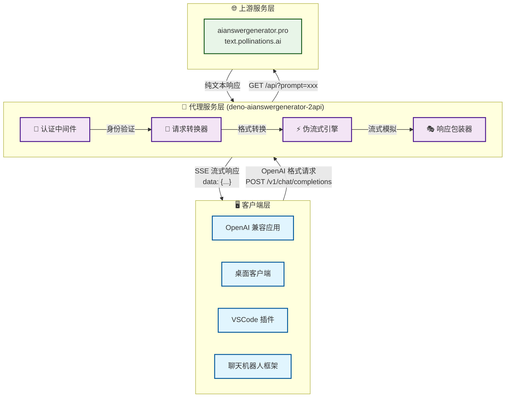
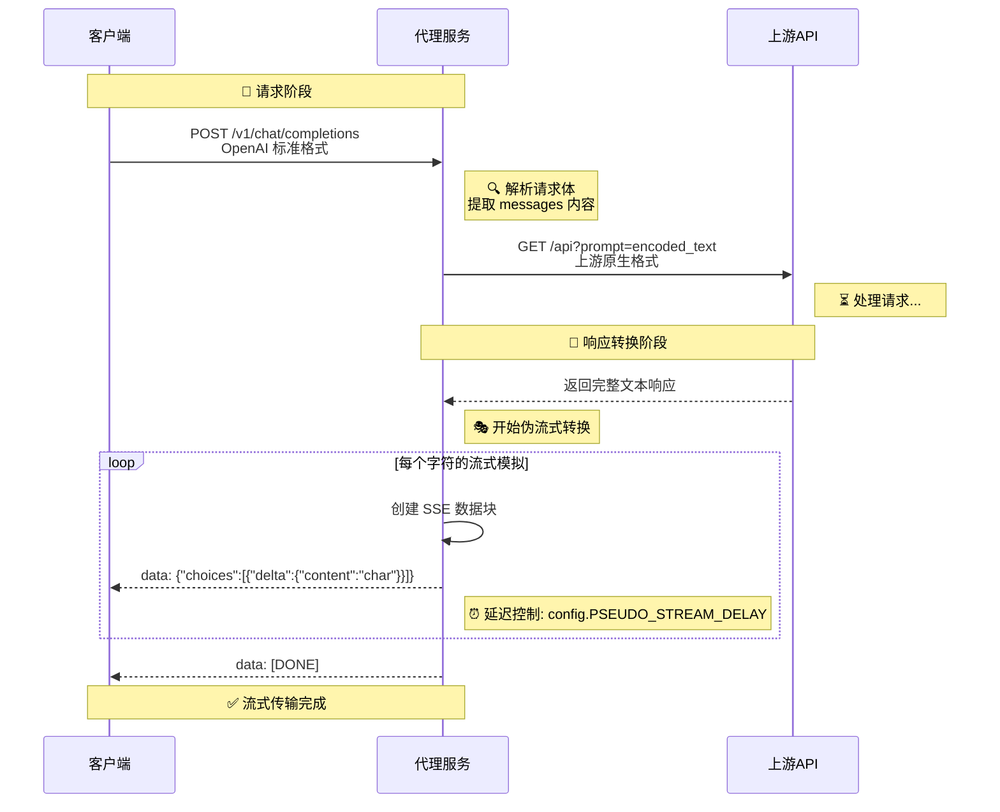
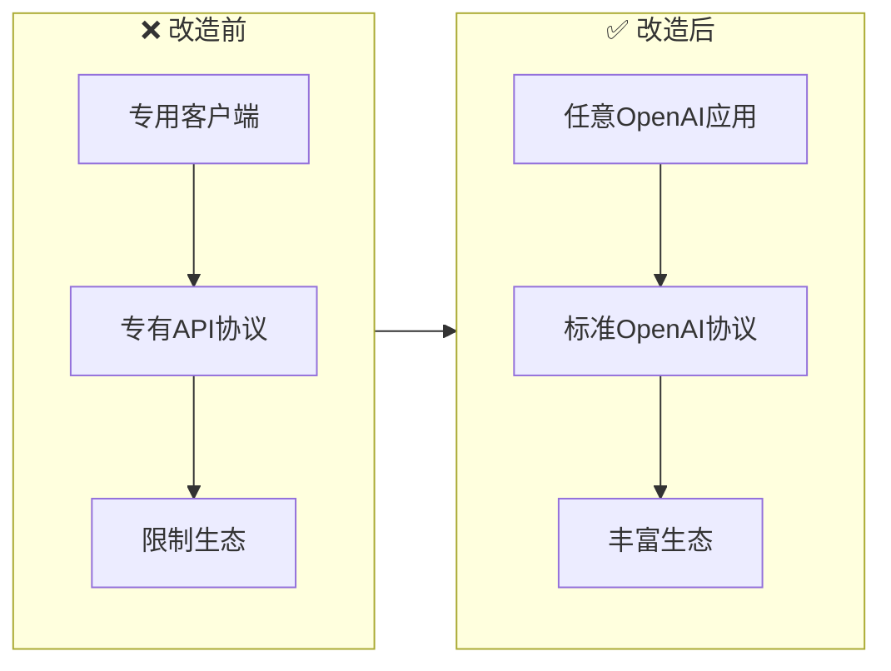
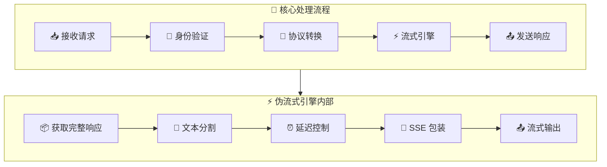
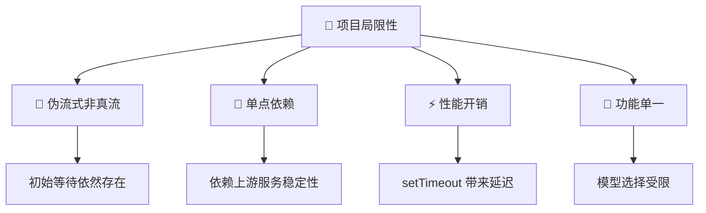
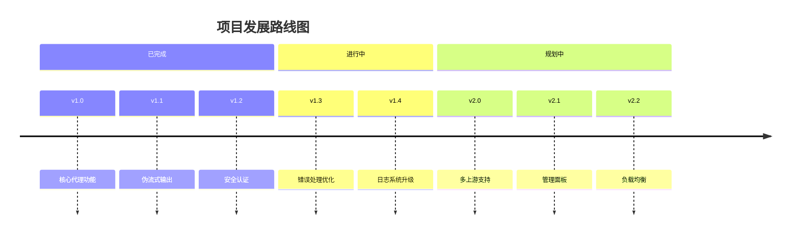
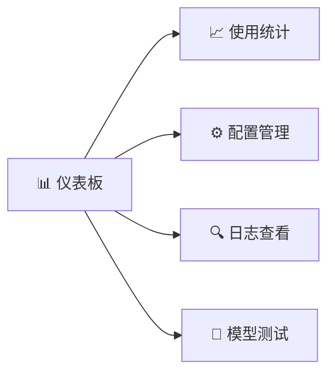
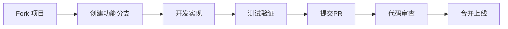

# 🚀 deno-aianswergenerator-2api: 你的 AI 接口"万能转换插头" 🔌

[](https://opensource.org/licenses/Apache-2.0)


> **项目链接**: [https://github.com/lzA6/deno-aianswergenerator-2api](https://github.com/lzA6/deno-aianswergenerator-2api)

欢迎来到 `deno-aianswergenerator-2api` 的世界！这是一个将非标准 AI 接口优雅转换为 OpenAI 格式的智能代理服务。它就像一位精通多国语言的外交官，连接不同的技术生态，实现"一句代码，通吃所有"的梦想！

---

## 🏗️ 系统架构全景图



## 📊 数据流转详解



---

## 📂 项目文件结构

```
📦 deno-aianswergenerator-2api/
├── 🗂️ .env                    # 环境配置文件
├── 🚀 main.ts                 # 核心服务入口
├── 📖 README.md              # 项目文档
└── 🛠️ .env.example           # 环境配置示例
```

---

## 🌟 核心价值与特性

### 🎯 项目定位

**AI 接口的"通用适配器"** - 将专有 API 协议转换为行业标准的 OpenAI 格式，实现生态兼容。

### ✨ 核心特性

| 特性 | 图标 | 描述 | 优势 |
|------|------|------|------|
| **生态兼容** | 🎯 | 支持所有 OpenAI 生态应用 | 立即接入海量现有工具 |
| **伪流式输出** | ⚡ | 模拟打字机效果的流式响应 | 提升用户体验，感觉更自然 |
| **极简部署** | 🚀 | 单文件架构，Deno 原生运行 | 无需复杂依赖，开箱即用 |
| **安全认证** | 🔐 | API Key 访问控制 | 保护服务免受滥用 |

### 📈 优势对比



---

## 🚀 快速开始

### 1. 环境准备

```bash
# 安装 Deno (跨平台)
# macOS/Linux
curl -fsSL https://deno.land/x/install/install.sh | sh

# Windows PowerShell
irm https://deno.land/x/install/install.ps1 | iex
```

### 2. 配置环境

创建 `.env` 文件：

```env
# 🔐 API 访问密钥
API_MASTER_KEY=your_secret_key_here

# 🌐 服务端口
NGINX_PORT=8090

# ⚡ 性能配置
API_REQUEST_TIMEOUT=30000
PSEUDO_STREAM_DELAY=10
```

### 3. 启动服务

**方式一：一键远程启动** (推荐)
```bash
deno run --allow-net --allow-env --allow-read \
  https://raw.githubusercontent.com/lzA6/deno-aianswergenerator-2api/main/main.ts
```

**方式二：本地部署**
```bash
git clone https://github.com/lzA6/deno-aianswergenerator-2api.git
cd deno-aianswergenerator-2api
deno run --allow-net --allow-env --allow-read main.ts
```

### 4. 客户端配置

在任何支持 OpenAI 的应用中使用以下配置：

```yaml
API Base URL: http://localhost:8090
API Key: your_secret_key_here
Model: aianswergenerator-openai
```

---

## 🛠️ 技术深度解析

### 🏗️ 核心架构组件



### 🔧 关键技术实现

#### 1. **配置管理**
```typescript
const config = {
  API_MASTER_KEY: Deno.env.get("API_MASTER_KEY") || "1",
  NGINX_PORT: parseInt(Deno.env.get("NGINX_PORT") || "8090"),
  API_REQUEST_TIMEOUT: 30000,
  PSEUDO_STREAM_DELAY: 10, // 流式延迟(ms)
};
```
**作用**: 集中管理所有配置参数，支持环境变量注入

#### 2. **SSE 流式引擎**
```typescript
const stream = new ReadableStream({
  async start(controller) {
    // 获取上游响应
    const fullText = await fetchUpstreamResponse(prompt);
    
    // 模拟流式输出
    for (const char of fullText) {
      const chunk = createOpenAIChunk(char);
      controller.enqueue(encodeSSE(chunk));
      await delay(config.PSEUDO_STREAM_DELAY);
    }
    
    controller.enqueue(encodeSSE({ done: true }));
    controller.close();
  }
});
```
**创新点**: 将一次性响应转换为字符级流式输出

#### 3. **协议转换层**
```typescript
// OpenAI → 上游API转换
const openAIMessage = request.messages[0].content;
const upstreamURL = `https://text.pollinations.ai/${encodeURIComponent(openAIMessage)}`;

// 上游响应 → OpenAI格式转换
const openAIResponse = {
  id: "chatcmpl-" + Date.now(),
  object: "chat.completion.chunk",
  choices: [{
    delta: { content: char },
    index: 0,
    finish_reason: null
  }]
};
```

---

## 📊 性能与局限性

### ✅ 优势分析

| 维度 | 评分 | 说明 |
|------|------|------|
| **生态兼容性** | ⭐⭐⭐⭐⭐ | 完美接入 OpenAI 生态 |
| **部署便捷性** | ⭐⭐⭐⭐⭐ | 单文件，零依赖 |
| **用户体验** | ⭐⭐⭐⭐☆ | 伪流式提升交互感受 |
| **代码质量** | ⭐⭐⭐⭐☆ | 简洁清晰，易于理解 |

### ⚠️ 局限性说明



### 🔄 对比分析

| 特性 | 本项目 | 传统方案 | 优势 |
|------|--------|----------|------|
| **部署复杂度** | 🟢 单文件 | 🔴 多依赖 | 简化 80% |
| **生态接入** | 🟢 立即可用 | 🔴 需要适配 | 节省开发时间 |
| **流式体验** | 🟡 模拟流式 | 🔴 无流式 | 用户体验提升 |

---

## 🗺️ 发展路线图

### 🎯 短期目标 (v1.x)



### 🔮 未来愿景

#### 1. **多上游支持** 🎯
```typescript
// 愿景：动态 Provider 选择
const providers = {
  'pollinations': PollinationsProvider,
  'gemini': GeminiProvider,
  'claude': ClaudeProvider
};

const provider = providers[request.model];
const response = await provider.chatCompletion(request);
```

#### 2. **可视化管理面板** 🖥️


#### 3. **高级特性** 🚀
- **智能缓存**: 请求去重，提升响应速度
- **负载均衡**: 多 API Key 轮询，避免限制
- **监控告警**: 服务状态实时监控

---

## 🤝 贡献指南

我们欢迎各种形式的贡献！以下是推荐的贡献流程：

### 🛠️ 开发流程



### 🎯 贡献方向

| 类型 | 图标 | 说明 | 难度 |
|------|------|------|------|
| **文档改进** | 📖 | 优化文档、修复错别字 | ⭐ |
| **Bug修复** | 🐛 | 修复已知问题 | ⭐⭐ |
| **功能增强** | ✨ | 新增实用功能 | ⭐⭐⭐ |
| **架构优化** | 🏗️ | 性能、架构改进 | ⭐⭐⭐⭐ |

### 🔧 开发环境设置

1. **克隆项目**
```bash
git clone https://github.com/lzA6/deno-aianswergenerator-2api.git
cd deno-aianswergenerator-2api
```

2. **安装依赖** (Deno 无需安装依赖)
```bash
# Deno 会自动管理依赖
```

3. **运行测试**
```bash
deno test --allow-net --allow-env
```

---

## 🎉 结语

> **致每一位开发者**:
>
> 在这个技术快速演进的时代，`deno-aianswergenerator-2api` 代表了"小而美"的解决方案哲学。它告诉我们：**不必等待完美，可以创造连接**。
>
> 每一个 `git commit` 都是进步的足迹，每一次 `PR` 都是社区的成长。这个项目不仅是一个工具，更是一种态度——开放、分享、创造。
>
> **让我们一起，用代码连接世界，让技术服务于每一个梦想！** 🌟
>
> ---
> *"我们不是在写代码，而是在建造通往未来的桥梁。"*

<div align="center">

**⭐ 如果这个项目对你有帮助，请给我们一个 Star！** [](https://github.com/lzA6/deno-aianswergenerator-2api)

</div>

---

<div align="center">

**🔗 相关链接**: [项目主页](https://github.com/lzA6/deno-aianswergenerator-2api) · [问题反馈](https://github.com/lzA6/deno-aianswergenerator-2api/issues) · [讨论区](https://github.com/lzA6/deno-aianswergenerator-2api/discussions)

*用 ❤️ 编写，为社区而生*

</div>
